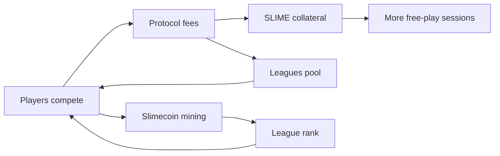

The Slimecoin flywheel connects gameplay volume to token rewards, free-play liquidity, and weekly competition.

## The loop

1. Players join free, SLIME, or paid queues.
2. Paid matches generate fees and mine Slimecoin.
3. Part of USD fees increases SLIME collateral.
4. Part of USD fees funds the weekly leagues pool.
5. Slimecoin balances contribute to league positioning.
6. SLIME production and leagues bring players back into games.

## Why the split matters

The flywheel uses different assets for different jobs:

- USDC is the deposited value and paid-match settlement asset.
- SLIME is the free-play liquidity layer.
- Slimecoin is the mined progression and leaderboard asset.

That separation lets Slimecoin.io support both casual play and paid competitive play without making one token do every job.
