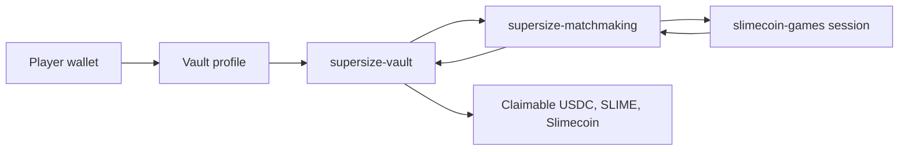
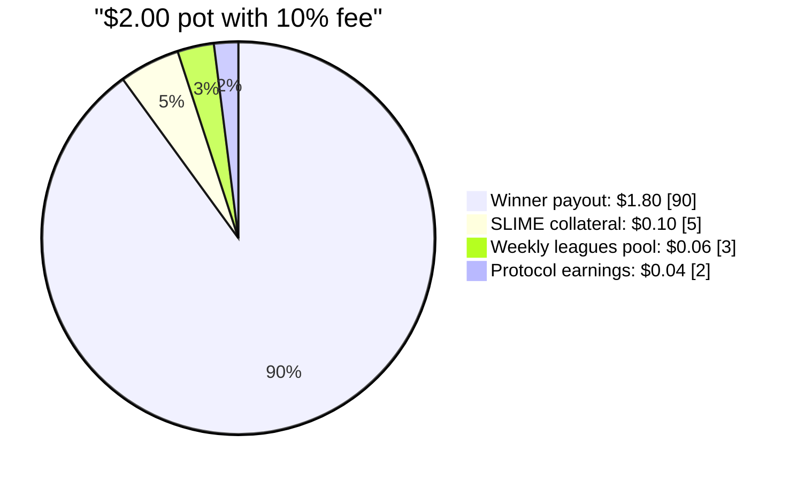

Slimecoin is a competitive gaming protocol built from three on-chain systems:

- **Supersize Vault** keeps player balances non-custodial, accounts for USDC, SLIME, Slimecoin, fees, leagues, and tournaments.
- **Supersize Matchmaking** pairs players by game, region, mint, and buy-in, then calls the vault to settle outcomes.
- **Slimecoin Games** is a library of fully on-chain games whose session state, scoring, seeds, and settlement hooks are written into Solana accounts.

The design goal is simple: players get fast arcade games with real, transparent settlement; investors and builders get an inspectable protocol where balances, fees, emissions, and reward pools are explicit on-chain state.

## The short version

<CardGroup cols={2}>
  <Card title="Start playing" icon="gamepad" href="/quickstart">
    Learn what happens when you create a profile, deposit, join a game, and claim rewards.
  </Card>
  <Card title="Slimecoin.io" icon="sparkles" href="/about-slimecoin-io/intro">
    Understand the player-facing platform, game modes, rewards, and wallet flow.
  </Card>
  <Card title="Protocol architecture" icon="network" href="/protocol/architecture">
    Understand how the vault, matchmaking program, and game program fit together.
  </Card>
  <Card title="Slimecoin" icon="coins" href="/tokens/slimecoin">
    See how the play-to-mine token is emitted per USD of gameplay and how halvings work.
  </Card>
  <Card title="Game library" icon="joystick" href="/games/library">
    Browse every on-chain game, its game ID, mode, scoring model, and settlement path.
  </Card>
  <Card title="Builder reference" icon="code" href="/developers/integration">
    Integrate profiles, queues, game sessions, payout claims, and program IDs.
  </Card>
</CardGroup>

## Core assets

| Asset | Role | Where it lives |
| --- | --- | --- |
| **USDC** | Deposited value, paid-entry buy-ins, withdrawals, league prizes | Player profile and vault token account |
| **SLIME** | Free-to-play currency backed by USDC collateral | Player profile and rollup ledger supply/collateral accounting |
| **Slimecoin** | Play-to-mine reward token | Player profile and payout accounts |

## How a paid match settles

For a standard paid match, both players lock the same buy-in. The higher score wins the pot less the platform fee. With the current product fee model of 10% of the pot, a $1 vs $1 match settles as:

The fee split is not a marketing abstraction. USD fees are recorded in each rollup ledger; half of those fees increase SLIME collateral, then accounting allocates 60% of the remaining half to weekly leagues and leaves 40% of that half claimable by the protocol.

## Source of truth

These docs are grounded in the current protocol source:

- `supersize-vault/programs/supersize-vault/src`
- `supersize-matchmaking/programs/supersize-matchmaking/src`
- `slimecoin-games/programs/slimecoin-games/src`
