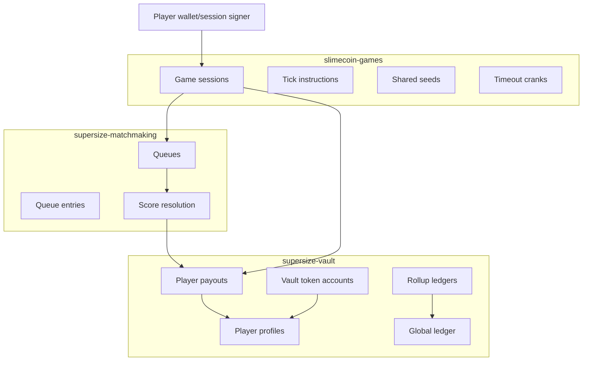

Slimecoin is not one contract. It is a set of programs with narrow responsibilities.

## Why split the protocol?

| Program | Owns | Does not own |
| --- | --- | --- |
| `supersize-vault` | Balances, rewards, fee accounting, player profiles, tournaments | Game rules or queue matching |
| `supersize-matchmaking` | Queue PDAs, waiting entries, score comparison, expiry refunds | Player balances or game tick logic |
| `slimecoin-games` | Game sessions, rules, ticks, random seeds, game-specific score calculation | Custody of player funds |

This keeps economic state centralized in the vault while allowing the game library to grow without rewriting balance logic.

## Execution model

The programs are Solana/Anchor programs designed for MagicBlock ephemeral rollups. Hot gameplay state can be delegated to regional rollups for low-latency ticking, then committed back. The main design pattern is:

1. Mainnet holds canonical program ownership and account addresses.
2. Regional rollups process delegated game, profile, payout, and ledger accounts.
3. Rollup ledgers aggregate fees, SLIME supply, Slimecoin paid, and weekly volume.
4. The global ledger reconciles rollup totals.

## Account model

| Account | Program | Purpose |
| --- | --- | --- |
| `Profile` | Vault | Player identity, session authority, USDC, SLIME, Slimecoin, lifetime stats |
| `PlayerPayouts` | Vault | Regional claimable rewards, locked buy-ins, weekly state, tournament payouts |
| `RollupLedger` | Vault | Per-validator fee, SLIME collateral, SLIME supply, Slimecoin paid, season state |
| `GlobalLedger` | Vault | Cross-rollup totals, global halving level, weekly leagues pool |
| `Queue` | Matchmaking | Game/mint/buy-in/validator queue with up to 16 waiting entries |
| Game session | Games | Player run state, score, seed, opponent link, game end slot |

## Region boundaries

Player payouts are keyed by `(player, validator)`. A profile has one selected region at a time, and game settlement validates that the profile, payout account, queue, and rollup ledger all agree on the validator region.

This matters because fees, weekly volume, SLIME supply, and claimable rewards are accounted per rollup before global accounting aggregates them.

## Settlement boundary

Game programs do not directly credit arbitrary player balances. They call:

- vault reserve/refund instructions for buy-ins
- matchmaking start/submit/resolve instructions for queue outcomes
- vault settlement instructions through the matchmaking authority

The vault validates that the caller is the authorized game signer or matchmaking authority before moving locked balances or crediting rewards.

## Source files

- Vault: `supersize-vault/programs/supersize-vault/src`
- Matchmaking: `supersize-matchmaking/programs/supersize-matchmaking/src`
- Games: `slimecoin-games/programs/slimecoin-games/src`
