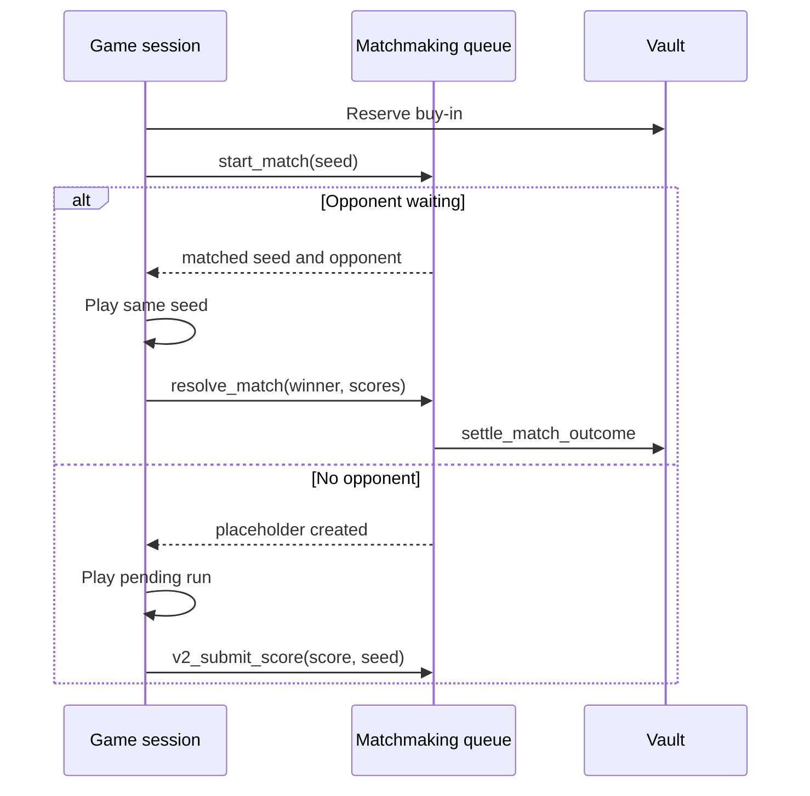

`supersize-matchmaking` pairs players and resolves score outcomes. It does not custody funds. Settlement is performed by CPI into the vault.

## Queue identity

A queue is a PDA derived from:

- game ID
- validator
- mint
- buy-in

This means a $1 USDC Match 3 queue in America is separate from a $1 SLIME queue, a $2.50 queue, or a Europe queue.

Each queue stores up to 16 entries. Each entry records:

- player payout account
- score
- lock expiry timestamp
- queue status
- RNG state or shared seed
- in-progress flag for match-on-join games

## Two matchmaking styles

### Score-after-play

Older flows enter matchmaking after the game is finished.

1. Player finishes a run.
2. Game submits score.
3. Matchmaking finds the best waiting opponent.
4. If no opponent exists, the score is queued.
5. If an opponent exists, the scores are compared and settlement runs.

### Match-on-join shared seed

Newer v3 games match before or during play.

1. Player joins and locks a buy-in.
2. Matchmaking either returns a waiting opponent's seed or queues an in-progress placeholder.
3. Both players play from the same seed.
4. Scores are deposited or resolved through the shared-seed payout path.
5. Timeout cranks settle or forfeit stale runs.

## Score resolution

The winner is determined by score:

| Result | Outcome |
| --- | --- |
| Player score greater than opponent score | Player wins |
| Player score less than opponent score | Opponent wins |
| Scores equal | Draw, both buy-ins are refunded |

The vault only settles if the matchmaking authority PDA signs the CPI and all accounts match the queue's validator and mint.

## Waiting entries and refunds

Waiting entries are locked for 48 hours by default. After expiry, the player session authority or protocol authority can refund the expired entry. The refund path:

1. validates the queue entry
2. validates the player's vault profile and payout PDA
3. calls the vault refund instruction through the matchmaking authority
4. clears the queue slot

## Timeout cranks

Shared-seed games schedule MagicBlock crank tasks at join time. Current shared-seed timeout configuration:

| Setting | Value |
| --- | --- |
| Timeout interval | 90 minutes |
| Crank iterations | 2 |
| Timeout score | 0 for unfinished forfeits |

The timeout path is conservative:

- if both linked sessions are live, scores must come from matching seeds and buy-ins
- if one side is stale or missing, deposited opponent scores can be authoritative
- if no valid live session or authoritative deposited score exists, settlement is rejected

This prevents stale queue placeholders from forcing ambiguous payouts.
