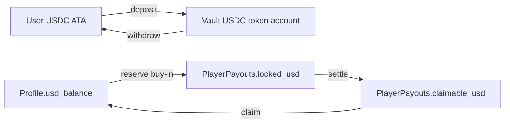
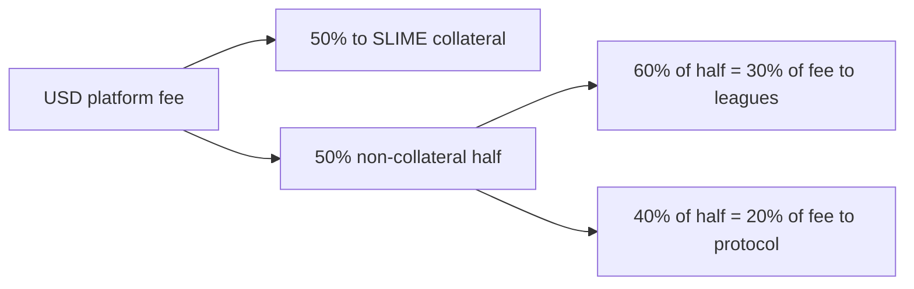

`supersize-vault` is the economic core of the protocol. It keeps custody and accounting separate from gameplay.

## What the vault stores

Each player has a `Profile` PDA keyed by their wallet. The profile stores:

- `authority`: the primary wallet
- `session_authority`: a gameplay signer authorized by the wallet
- `usd_balance`: deposited USDC
- `slime_balance`: free-to-play SLIME
- `slimecoin_balance`: mined Slimecoin
- lifetime buy-ins, winnings, and platform earnings
- current season and region
- optional sponsored account state and bonus cash

Each player also has a `PlayerPayouts` PDA per allowed validator. This stores:

- pending `claimable_usd`, `claimable_slime`, and `claimable_slimecoin`
- `locked_usd` and `locked_slime` reserved for active games
- weekly volume and Slime Rush progress
- practice quest progress and practice wins
- weekly leagues payout
- tournament payout

## Non-custodial balance flow

Players deposit USDC into a vault token account controlled by a program-derived token owner. The vault updates the player's profile balance, but the program can only move funds according to its instructions and PDA signer rules.

## Buy-ins

The games program calls vault reserve instructions when a player starts a game.

| Mode | Reserved field | Notes |
| --- | --- | --- |
| USDC paid match | `locked_usd` | Increments lifetime buy-ins and contributes weekly volume after settlement |
| SLIME queue | `locked_slime` | Used for SLIME-denominated free-play queues |
| USDC-to-SLIME mode | `locked_usd` | Player spends SLIME equivalent, settlement can refund SLIME from USD accounting |

The vault validates:

- the caller is the `slimecoin-games` game signer
- the game session account is owned by `slimecoin-games`
- the validator is allowed
- the profile, payouts account, and validator region match
- the session authority is valid, unless the protocol authority is sponsoring the call

## Claiming payouts

Game settlement credits rewards to `PlayerPayouts` first. `claim_player_payouts` then moves:

- `claimable_slimecoin` into `Profile.slimecoin_balance`
- `claimable_usd` into `Profile.usd_balance`
- `claimable_slime` into `Profile.slime_balance`

This two-step model lets games settle inside rollup flow while users claim consolidated balances later.

## Fees

The vault fee rate is stored per rollup ledger as `platform_fee_bps`. The live product model is a 10% fee on the pot.

For USD matches, fees are logged to the rollup:

- 50% of fees increase SLIME collateral
- 30% of fees become the base weekly leagues pool after global accounting
- 20% of fees are claimable protocol earnings

For SLIME matches, fees are logged as SLIME fees. They increase SLIME accounting capacity rather than USDC weekly fees.

## Global and rollup ledgers

`RollupLedger` tracks a single validator's:

- current season
- halving level
- Slimecoin paid
- total USD fees and weekly USD fees
- SLIME USDC collateral
- SLIME supply
- total SLIME fees
- claimed leagues rewards

`GlobalLedger` aggregates the three rollup ledgers. It computes:

- total SLIME supply and collateral
- total fees
- total weekly fees
- total Slimecoin remaining in treasury
- global halving level
- weekly leagues pool

The global ledger is the cross-region accounting view. Rollup ledgers are the regional execution view.
