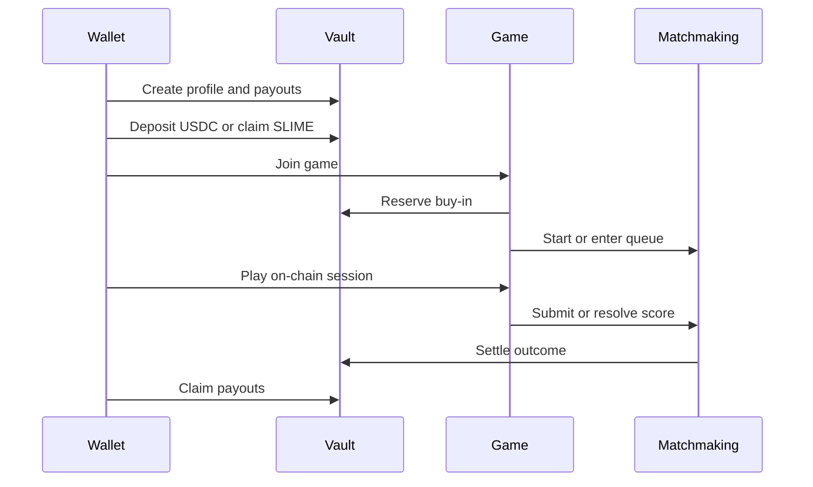

This page explains the player flow without hiding the protocol mechanics.

## 1. Create a profile

Your wallet owns a **Vault profile** PDA. The profile stores your primary balances:

- USDC balance
- SLIME balance
- Slimecoin balance
- lifetime buy-ins, winnings, and platform earnings
- your session authority, which lets gameplay use a fast session signer without taking custody of your wallet

Your profile is paired with a **PlayerPayouts** PDA for each rollup region. Payouts, pending rewards, and locked buy-ins live there before being claimed into your profile.

## 2. Choose a region

The protocol supports three allowed payout validators:

| Region | Purpose |
| --- | --- |
| Europe | Regional rollup and player payout domain |
| America | Regional rollup and player payout domain |
| Asia | Regional rollup and player payout domain |

The validator determines which rollup ledger accounts for your game, fees, SLIME collateral, weekly quests, and claimable rewards.

## 3. Fund or earn playable balances

There are three ways balances enter the player experience:

| Action | Result |
| --- | --- |
| Deposit USDC | Increases your vault USDC balance |
| Swap USDC to SLIME | Mints SLIME at 1 USDC = 1,000 SLIME, within protocol limits |
| Claim SLIME | Produces free-play SLIME over time, capped by your Slime Rush level and backed by rollup capacity |

## 4. Join a game

Every game start does three things:

1. Reserves the buy-in in the vault.
2. Creates or resumes an on-chain game session.
3. Enters matchmaking, either by matching you immediately or creating a waiting placeholder.

Paid queues use USDC or SLIME depending on the selected mode. Free queues use 0 buy-in but still run through the same session and score validation paths.

## 5. Finish, settle, and claim

When the game ends, the game program submits or resolves the score through matchmaking. The vault then:

- releases locked buy-ins
- credits the winner payout, or refunds both players on a draw
- credits Slimecoin rewards for paid USD matches
- records fees, weekly volume, practice wins, and league accounting

Rewards first land in your regional `PlayerPayouts` account. Claiming moves `claimable_usd`, `claimable_slime`, and `claimable_slimecoin` into your profile.

## Typical lifecycle

<Tip>
  You never send assets to an off-chain game server. The vault holds token accounts through PDAs, and game sessions are program-owned accounts.
</Tip>
