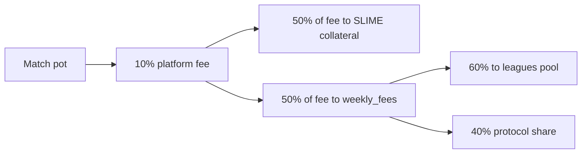

Leagues are the weekly competitive layer above individual matches.

Players rank by Slimecoin balance in the public leaderboard. The app maps ranks into tiers:

| Rank | League |
| ---: | --- |
| 1-10 | Diamond |
| 11-20 | Emerald |
| 21-30 | Gold |
| 31-50 | Silver |
| 51-80 | Bronze |
| 81-300 | Iron |
| 301+ or unranked | Unranked |

## Funding the pool

The weekly leagues pool is funded from protocol fee accounting. With the current 10% fee model:

As a share of the total pot, that is:

| Pot share | Destination |
| ---: | --- |
| 90% | Winner payout |
| 5% | SLIME collateral |
| 3% | Leagues pool |
| 2% | Protocol earnings |

The weekly pool can also include:

- unclaimed rewards from the previous pool
- optional protocol-seeded bonus rewards

## Payout lifecycle

1. Rollup ledgers collect fees during the week.
2. Rollup ledgers are committed.
3. Global accounting aggregates all regions.
4. The global ledger computes the new weekly leagues pool.
5. The protocol assigns player payouts for the current season.
6. Players claim league payouts into profile USDC.

The vault enforces that league claims match the current season. This prevents stale weekly payouts from being claimed after the season changes.

## What leagues measure

The public leaderboard ranks by Slimecoin balance. That connects leagues to long-term mined progress, not only to one isolated weekly game result.

<Note>
  The rendered leaderboard and player display metadata are indexed off-chain, but the claimable leagues payout is stored and claimed through vault accounts.
</Note>
