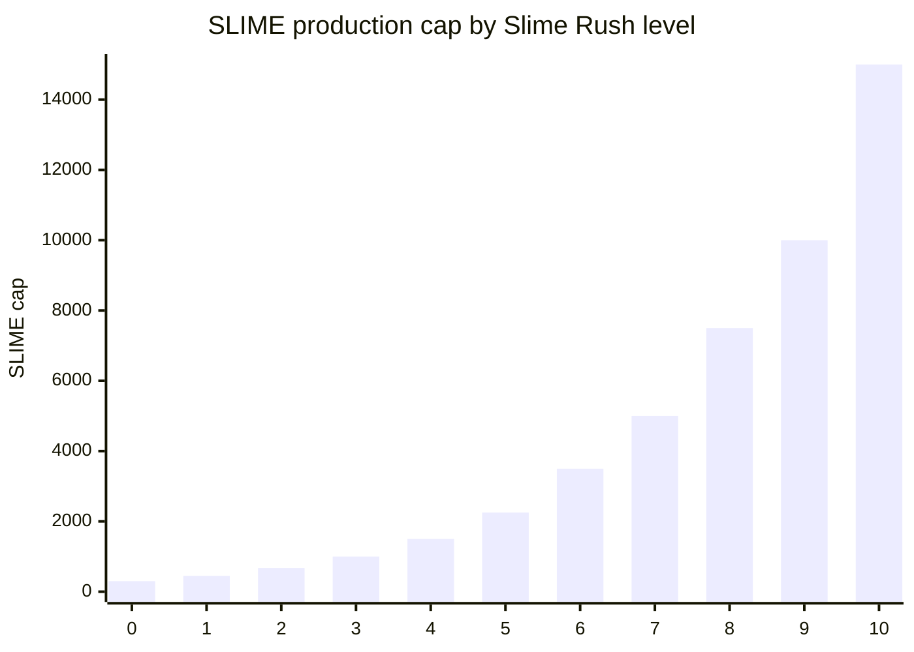

Slime Rush is the weekly activity system attached to SLIME production.

As players generate weekly gameplay volume, they can claim milestones. Each claimed milestone increases the SLIME production multiplier and raises the inventory cap.

## Weekly milestones

| Level | Weekly volume target | SLIME production boost | Production cap |
| ---: | ---: | ---: | ---: |
| 0 | $0 | 0% | 300 SLIME |
| 1 | $0.10 | 5% | 450 SLIME |
| 2 | $0.25 | 10% | 675 SLIME |
| 3 | $0.50 | 15% | 1,000 SLIME |
| 4 | $1 | 20% | 1,500 SLIME |
| 5 | $2 | 25% | 2,250 SLIME |
| 6 | $4 | 30% | 3,500 SLIME |
| 7 | $8 | 40% | 5,000 SLIME |
| 8 | $16 | 60% | 7,500 SLIME |
| 9 | $32 | 80% | 10,000 SLIME |
| 10 | $64 | 100% | 15,000 SLIME |

## How volume is counted

When a match settles, the vault adds weekly volume for both players. USDC matches add the buy-in amount. SLIME matches add the USD-equivalent amount based on the 1 USDC = 1,000 SLIME conversion.

Weekly volume is capped for boost tracking at $100, so very high activity does not overflow the weekly boost accounting.

## Claiming milestones

The vault stores weekly quest progress as a bitmask. Claiming a weekly quest synchronizes completed volume milestones and updates the player's `slime_boost_multiplier`.

At season rollover, the rollup ledger season advances and weekly quest state resets:

- weekly volume -> 0
- weekly quest bits -> 0
- SLIME boost -> 1x

## Production chart

## Design purpose

Slime Rush links free-play capacity to recent activity. It gives casual players a reason to keep playing while preserving a hard cap on how much unspent SLIME can accumulate at each level.
