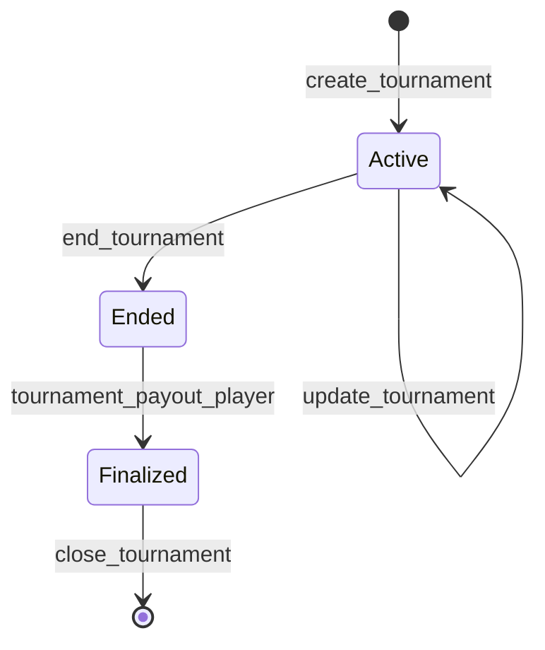

Tournaments are vault-managed contests keyed by a tournament ID.

The `Tournament` account stores:

- tournament ID
- game ID
- status: active, ended, or finalized
- entry fee
- prize pool
- platform earnings
- total entries
- distributed prizes
- start and end timestamps

## Lifecycle

## Entry fees and prizes

Tournament entry fees are tracked separately from head-to-head match buy-ins. The tournament account accumulates:

- prize pool additions
- platform earnings additions
- total entries
- total prizes distributed

Player tournament payouts land in `PlayerPayouts.tournament_payout` and can be claimed through the tournament payout claim path.

## Why tournaments live in the vault

Tournaments are economic objects. They need the same balance, authority, and payout guarantees as matches, but their game logic and leaderboard calculation can be specific to the tournament format. Keeping tournament funds in the vault avoids creating a separate custody model for scheduled contests.
