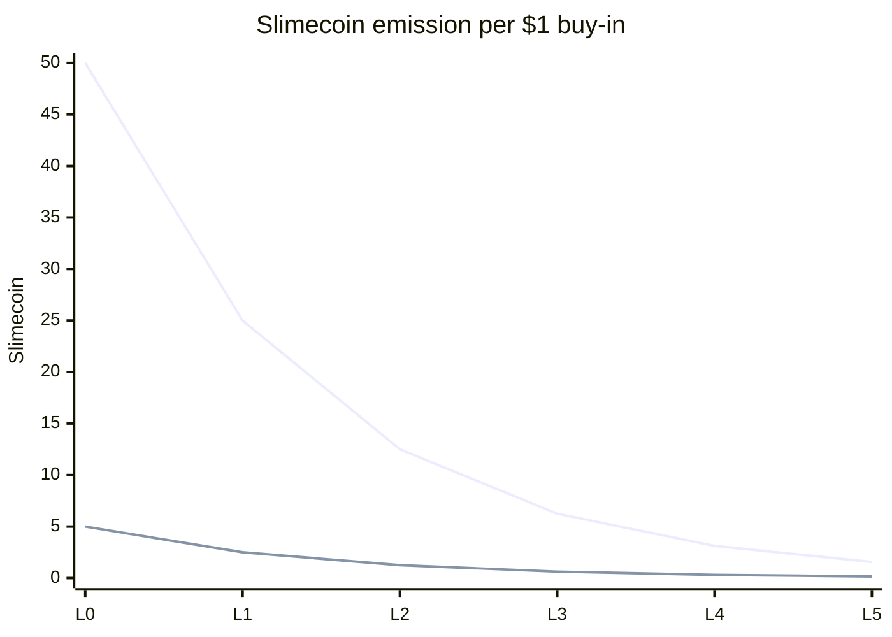

Slimecoin is the protocol's play-to-mine token. It is earned through gameplay, not bought from the vault.

## Supply

The vault defines a total mineable Slimecoin supply of **500,000,000 Slimecoin** with 9 token decimals.

The global ledger tracks how much Slimecoin remains in treasury. As players mine Slimecoin, `slimecoin_holdings` falls and the protocol moves through halving levels.

## How mining works

In a paid USD match, both players can receive Slimecoin:

- the winner receives the higher Slimecoin reward
- the loser receives the lower participation reward
- both rewards scale with the USD buy-in
- both rewards halve as the remaining mineable supply crosses halving thresholds

At halving level 0:

| Player result | Slimecoin mined per $1 buy-in |
| --- | ---: |
| Winner | 50 Slimecoin |
| Loser | 5 Slimecoin |

For example, at level 0 a $5 paid match awards 250 Slimecoin to the winner and 25 Slimecoin to the loser.

<Note>
  SLIME-denominated matches settle SLIME payouts, but they do not mine Slimecoin through the USD buy-in reward path.
</Note>

## Halving schedule

The halving level is based on remaining treasury holdings as a percentage of the total 500M supply. Level 0 applies while more than 50% remains. Once treasury holdings are at or below 50%, the level increments. Each further halving threshold halves the emission rate again.

| Halving level | Remaining Slimecoin supply | Winner per $1 | Loser per $1 |
| ---: | --- | ---: | ---: |
| 0 | More than 250,000,000 | 50 | 5 |
| 1 | 250,000,000 or less | 25 | 2.5 |
| 2 | 125,000,000 or less | 12.5 | 1.25 |
| 3 | 62,500,000 or less | 6.25 | 0.625 |
| 4 | 31,250,000 or less | 3.125 | 0.3125 |
| 5 | 15,625,000 or less | 1.5625 | 0.15625 |



## Why per-USD emissions matter

Slimecoin rewards are tied to actual gameplay buy-ins, not to time alone. This makes emissions volume-based:

```text
player reward = buy-in in USD * current reward ratio
```

The protocol can therefore reason about Slimecoin issuance relative to paid game activity, while halvings slow issuance as the mineable treasury runs down.

## Practice quest mining

Practice wins can also claim small Slimecoin prizes. The vault tracks up to 10 practice wins and awards the lower per-USD Slimecoin rate for each newly claimed practice quest step. This gives new players a path to touch Slimecoin without requiring every reward to come from paid head-to-head play.

## Where rewards land

Game settlement credits Slimecoin into `PlayerPayouts.claimable_slimecoin`. When the player claims payouts, that amount moves into `Profile.slimecoin_balance`.
